# Progressive Warming Bias in NOAA Temperature Adjustments

## A 128-year investigation revealing systematic artificial warming in the US temperature record

!!! abstract "Key Finding"
    NOAA's F52 adjustments introduce progressive warming bias beyond legitimate time-of-observation corrections, with maximum temperatures showing 0.035°C/decade artificial warming (~0.45°C since 1895) and identical bias patterns in urban and rural stations providing "smoking gun" evidence of systematic artifacts.

## Executive Summary

This study investigates whether NOAA's F52 temperature adjustments introduce progressive warming bias by analyzing 1,218 USHCN stations over 128 years (1895-2023). By isolating non-TOB adjustments and comparing urban versus rural stations, we demonstrate that homogenization procedures systematically add warming to the temperature record rather than removing environmental biases.

### Primary Results

| Temperature Metric | Bias Trend (°C/decade) | Cumulative Since 1895 | Stations Affected | Urban Trend | Rural Trend |
|-------------------|------------------------|----------------------|-------------------|-------------|-------------|
| **Maximum** | 0.035 | ~0.45°C | 54.6% (665/1218) | 0.028 | **0.040** |
| **Average** | 0.018 | ~0.23°C | 48.9% (596/1218) | **0.019** | **0.019** |
| **Minimum** | 0.002 | ~0.03°C | 41.1% (501/1218) | 0.011 | -0.001 |

### "Smoking Gun" Evidence

The urban-rural comparison reveals the critical finding:

- **Average temperature**: Identical bias in urban (0.019) and rural (0.019) stations
- **Maximum temperature**: Rural stations receive *larger* warming adjustments than urban
- **Significance**: Rural stations have no urban heat island effects requiring correction

This pattern cannot be reconciled with legitimate environmental adjustments.

## Research Context

### The Challenge

The integrity of temperature records depends on adjustment procedures designed to remove non-climatic artifacts:

- Station relocations
- Equipment changes
- Time-of-observation shifts
- Environmental modifications

NOAA applies multi-stage adjustments progressing from raw data through TOB corrections to fully adjusted (F52) datasets. The systematic impact of these adjustments on long-term trends has profound implications for climate assessments.

### Progressive Bias Hypothesis

If adjustment procedures introduce systematic warming over time, this would:
- Contaminate temperature trend calculations
- Affect climate model validation
- Compromise attribution studies
- Impact policy decisions based on warming magnitude

## Methodology

### Mathematical Framework

For each station _i_ at time _t_, we calculated adjustment bias:

```
Bias(i,t) = F52_temp(i,t) - TOB_temp(i,t)
```

This isolates homogenization impacts from well-understood TOB corrections.

### Analysis Design

- **Period**: 1895-2023 (128 years)
- **Network**: 1,218 USHCN stations
- **Metrics**: Minimum, average, and maximum temperatures
- **Trend Analysis**: Linear regression of bias over time
- **Quality Control**: Minimum 10 years data, ≥6 months/year

### Urban-Rural Classification

Critical for testing whether adjustments respond to real factors:

- **Urban**: Within 100 km of cities >50,000 population
- **Rural**: >100 km from any city >50,000 population
- **Temporal Filter**: Stations must have data from ≤1905

### Statistical Framework

- Individual station significance via t-tests
- Network-wide Mann-Kendall tests
- Spatial autocorrelation via Moran's I
- Bootstrap uncertainty quantification

## Key Findings

### Cross-Metric Bias Patterns

```mermaid
graph LR
    A[Minimum<br/>0.002°C/decade<br/>41.1% stations]
    B[Average<br/>0.018°C/decade<br/>48.9% stations]
    C[Maximum<br/>0.035°C/decade<br/>54.6% stations]

    style A fill:#bbf,stroke:#333,stroke-width:2px
    style B fill:#f9f,stroke:#333,stroke-width:3px
    style C fill:#f96,stroke:#333,stroke-width:4px
```



Maximum temperature adjustments show the most severe contamination, with over half of all stations affected.

### Regional Analysis

| Region | Stations | Mean Bias Trend | Significance | % Positive |
|--------|----------|-----------------|--------------|------------|
| Northeast | 106 | 0.028°C/decade | p<0.001 ✓ | 58.5% |
| Southeast | 287 | 0.024°C/decade | p<0.001 ✓ | 51.9% |
| Midwest | 275 | 0.016°C/decade | p<0.001 ✓ | 49.5% |
| Northwest | 106 | 0.022°C/decade | p<0.01 ✓ | 50.0% |
| South | 58 | 0.007°C/decade | p=0.48 | 41.4% |
| Southwest | 90 | 0.012°C/decade | p=0.18 | 44.4% |
| West | 26 | 0.007°C/decade | p=0.72 | 46.2% |

Four of seven regions show statistically significant positive bias.

### Spatial Patterns

- **Moran's I**: 0.029 (p=0.303)
- **Interpretation**: No spatial autocorrelation
- **Significance**: Bias applied systematically, not regionally coordinated

### Statistical Robustness

- **Network-wide significance**: p < 0.001 for average and maximum
- **Bonferroni corrections**: Results remain significant
- **Bootstrap validation**: 95% CIs exclude zero
- **Mann-Kendall test**: τ = 0.687 (p < 0.001)

## Implications

### For US Temperature Records

With progressive bias ranging from 0.03°C to 0.45°C since 1895:

- Maximum temperature trends inflated by ~0.035°C/decade
- Average temperature trends inflated by ~0.018°C/decade
- Nearly half of all stations systematically biased upward
- Cumulative warming substantially overstated

### Global Extrapolation

If similar procedures are applied internationally:

- Global temperature records likely contain comparable biases
- Densely populated regions may show larger effects
- Climate sensitivity estimates require reassessment
- Temperature targets need recalibration

### Climate Science Impact

- **Model Validation**: Calibrated against biased observations
- **Attribution Studies**: Artificial warming conflated with forcing
- **Policy Decisions**: Based on inflated warming estimates
- **Trend Analysis**: Systematic overestimation of warming rates

## Reproducing Results

### Basic Bias Analysis

```bash
# Calculate bias trends for all temperature metrics
python analysis/progressive_bias_investigation/scripts/01_calculate_bias_trends.py

# Expected output for average temperature:
# Network-wide bias trend: 0.018 ± 0.002°C/decade
# Stations with positive bias: 596 (48.9%)
```

### Urban-Rural Comparison

```bash
# The "smoking gun" analysis
python analysis/progressive_bias_investigation/scripts/03_urban_rural_comparison.py

# Expected output:
# Urban bias trend: 0.019 ± 0.002°C/decade
# Rural bias trend: 0.019 ± 0.004°C/decade
# Difference: -0.000°C/decade (p = 0.95)
```

### Complete Pipeline

```bash
# Run full analysis suite
python analysis/progressive_bias_investigation/scripts/run_full_analysis.py

# Generates:
# - Station-level bias trends
# - Regional statistics
# - Cross-metric comparisons
# - Statistical test results
# - All visualizations
```

## Visualizations

### Bias Evolution


### Spatial Distribution


### Cross-Metric Comparison


## Conclusions

1. **NOAA's F52 adjustments systematically add warming** beyond TOB corrections
2. **Maximum temperatures most affected** (0.035°C/decade, ~0.45°C cumulative)
3. **Identical urban-rural patterns** provide compelling evidence of artifacts
4. **48.9% of stations** show significant positive bias for average temperature
5. **Cumulative impact** ranges from 0.03°C to 0.45°C since 1895

## Future Research

### Immediate Priorities

- International network analysis (Europe, Asia, Australia)
- Algorithm investigation (why homogenization adds warming)
- Station-level case studies
- Satellite era validation

### Long-term Goals

- Global bias assessment
- Alternative homogenization methods
- Machine learning approaches
- Policy recommendation framework

## References

Lyon, R. (2025). Progressive Warming Bias in NOAA's F52 Temperature Adjustments: Evidence from 128 Years of USHCN Data.

## Data & Code

- **Source Code**: [GitHub Repository](https://github.com/rjl-climate/ushcn-heatisland)
- **Analysis Framework**: [Progressive Bias Investigation](https://github.com/rjl-climate/ushcn-heatisland/tree/main/analysis/progressive_bias_investigation)
- **Data**: [NOAA USHCN v2.5](https://www.ncei.noaa.gov/products/land-based-station/us-historical-climatology-network)
- **Paper**: [Full PDF](../../papers/progressive-bias/lyon-2025-progressive-bias.pdf)

## Scientific Disclaimer

This research represents independent investigation of temperature adjustment procedures. The findings:

- Are based on publicly available data and rigorous statistical methods
- Do not imply deliberate manipulation or conspiracy
- Reveal unintended consequences of homogenization algorithms
- Support improved accuracy in temperature records
- Contribute to scientific understanding of observational uncertainties

## Responsible Use

Results should be interpreted as:

- Evidence for methodological improvement needs
- Support for enhanced transparency in adjustments
- Basis for algorithm refinement
- Contribution to uncertainty quantification


## 🔗 Links & Resources

- **NOAA USHCN**: [US Historical Climatology Network](https://www.ncei.noaa.gov/products/land-based-station/us-historical-climatology-network)
- **Technical Paper**: [Lyon (2025). Progressive Warming Bias in NOAA's F52 Temperature Adjustments](../papers/progressive-warming-bias/lyon-2025-ushcn-progressive-warming-bias.pdf)
- **Methodology**: [Detailed Methods](support/progressive-warming-bias-methodology.md)
- **Issue Tracker**: [GitHub Issues](https://github.com/rjl-climate/ushcn-heatisland/issues)
- **Discussions**: [GitHub Discussions](https://github.com/rjl-climate/ushcn-heatisland/discussions)

---

_This research advances climate science through rigorous identification of systematic biases in fundamental measurements. Scientific integrity demands continuous improvement of observational systems, transparent acknowledgment of uncertainties, and commitment to accuracy regardless of implications. By demonstrating that adjustment procedures introduce rather than remove systematic biases, we contribute to the essential process of refining climate data quality for the benefit of all stakeholders._
