# Urban Heat Island Contamination in USHCN Temperature Records

**A comprehensive analysis revealing that NOAA temperature adjustments enhance rather than remove urban heat island signals**

!!! abstract "Key Finding"
NOAA adjustments enhance urban heat island signals by **9.4%** rather than removing them, with **22.7%** of USHCN stations experiencing urban heat island contamination averaging **0.725°C**.

## Executive Summary

This study investigates whether NOAA temperature adjustments successfully remove urban heat island (UHI) contamination from the US temperature record. Analysis of 126 years of data from 1,218 weather stations reveals that adjustments actually _enhance_ urban warming signals rather than removing them.

### Primary Results

| Dataset            | UHII (°C) | Change from Raw | p-value    | Effect Size  |
| ------------------ | --------- | --------------- | ---------- | ------------ |
| Raw                | 0.662     | —               | 0.004      | d = 0.58     |
| TOBs Adjusted      | 0.522     | -21.1%          | 0.022      | d = 0.46     |
| **Fully Adjusted** | **0.725** | **+9.4%**       | **<0.001** | **d = 0.97** |

### Dual Contamination Pattern

The analysis reveals two distinct forms of urban heat island contamination:

1. **Baseline Temperature Elevation**: 2.98°C persistent difference between urban and rural stations
2. **Differential Warming Trend**: 0.725°C additional warming in urban areas over 126 years
3. **Total Effect**: ~3.7°C combined contamination affecting 22.7% of stations

## Research Context

### The Challenge

The US Historical Climatology Network (USHCN) provides critical temperature data for climate assessments. NOAA applies adjustments to remove non-climatic biases including:

- Time-of-observation changes
- Station relocations
- Equipment changes
- Urban heat island effects

The effectiveness of these adjustments in removing urban warming signals has significant implications for climate science.

### Urban Heat Islands

Urban areas create localized warming through:

- Reduced evapotranspiration from vegetation loss
- Increased heat absorption by built surfaces
- Anthropogenic heat release
- Modified atmospheric circulation

Given that many weather stations are in or near growing population centers, UHI contamination poses a significant challenge to temperature record integrity.

## Methodology

### Analysis Framework

We employed a "steel-man" approach, using parameters that maximize urban heat island detection:

- **Time Period**: 1895-2020 (126 years)
- **Baseline**: 1895-1924
- **Current**: 1991-2020
- **Temperature Metric**: Minimum temperatures (strongest UHI signal)
- **Network**: 1,218 USHCN stations

### Urban Classification

Stations classified by distance to population centers:

1. **Urban Core**: <25km from cities ≥250,000 (26 stations, 2.1%)
2. **Urban Fringe**: 25-50km from cities ≥100,000 (120 stations, 9.9%)
3. **Suburban**: 50-100km from cities ≥50,000 (405 stations, 33.3%)
4. **Rural**: >100km from cities ≥50,000 (667 stations, 54.8%)

### Calculations

```
Temperature Anomaly = Mean(Current Period) - Mean(Baseline Period)
UHII = Mean(Urban Anomalies) - Mean(Rural Anomalies)
```

### Statistical Methods

- Independent samples t-test
- Mann-Whitney U test
- Cohen's d effect size
- 95% confidence intervals via bootstrap

## Key Findings

### The Adjustment Paradox

NOAA's adjustment process creates an unexpected **U-shaped pattern**:

```mermaid
graph LR
    A[Raw Data<br/>0.662°C] -->|TOBs Adjustment<br/>-21.1%| B[TOBs Adjusted<br/>0.522°C]
    B -->|Homogenization<br/>+38.8%| C[Fully Adjusted<br/>0.725°C]

    style A fill:#f9f,stroke:#333,stroke-width:2px
    style B fill:#bbf,stroke:#333,stroke-width:2px
    style C fill:#f96,stroke:#333,stroke-width:4px
```



This suggests that while time-of-observation corrections reduce urban signals, subsequent homogenization procedures more than reverse this reduction.

### Absolute Temperature Differences

Beyond differential warming trends, urban stations show persistent baseline elevation:

- **Minimum Temperature UHI**: 2.98°C (year-round)
- **Maximum Temperature UHI**: 0.59°C (summer)

The 5× difference between nighttime and daytime UHI aligns with established urban thermal dynamics.

### Network Quality Considerations

Analysis revealed critical network coverage issues:

- Pre-1895: Only 64 average stations (inadequate)
- 1890-1908: 5× expansion potentially creating artifacts
- Post-1908: Stable 1,218 stations (adequate coverage)

We constrained analysis to post-1895 to ensure reliable results.

## Implications

### For the United States

With only 2.1% of stations in urban cores and 36 people/km², the US represents a **best-case scenario**. Yet we still find:

- 22.7% of stations affected by UHI
- 0.725°C warming trend contamination
- 2.98°C baseline contamination
- Enhancement rather than removal by adjustments

### Global Extrapolation

More densely populated regions face greater challenges:

| Country     | Population Density | Relative to US | Expected UHI Impact |
| ----------- | ------------------ | -------------- | ------------------- |
| USA         | 36 people/km²      | 1.0×           | 22.7% contamination |
| UK          | 275 people/km²     | 7.6×           | Much higher         |
| Germany     | 240 people/km²     | 6.7×           | Much higher         |
| Japan       | 347 people/km²     | 9.6×           | Much higher         |
| Netherlands | 508 people/km²     | 14.1×          | Severe              |

### Climate Science Impact

1. **Temperature Records**: Both baseline and trend contamination persist
2. **Model Validation**: Observational data contains systematic warm biases
3. **Policy Targets**: Temperature goals may need recalibration
4. **Attribution Studies**: Urban warming conflated with climate signals

## Reproducing Results

### Main Finding

```bash
# Reproduce Table 2 from paper
ushcn-heatisland analyze adjustment_impact \
  --temp-metric min \
  --baseline-start-year 1895 \
  --current-start-year 1991 \
  --period-length 30
```

Expected output:

- Raw UHII: 0.662°C
- TOBs UHII: 0.522°C (-21.1%)
- Fully Adjusted UHII: 0.725°C (+9.4%)

### Enhanced Analysis

```bash
# Network quality-informed analysis
cd analysis/ushcn_uhii_analysis_1895_plus
python create_min_temp_uhii_plot_1895.py
```

Results: 2.975°C minimum temperature UHI

### Visualizations

```bash
# Generate Figure 1
cd analysis/network_visualisation
python create_network_visualisation.py
```

## Conclusions

1. **NOAA adjustments enhance rather than remove urban heat island signals**
2. **The enhancement (+9.4%) results from homogenization procedures**
3. **Total UHI contamination approaches 3.7°C for affected stations**
4. **22.7% of the USHCN network experiences this contamination**
5. **Global implications likely more severe in densely populated regions**

## Future Research

### Immediate Priorities

- Analyze temperature networks in Europe, East Asia
- Investigate why homogenization enhances urban signals
- Compare with satellite temperature records
- Station-by-station adjustment analysis

### Long-term Goals

- Global GHCN analysis
- Alternative homogenization methods
- Machine learning approaches
- Policy recommendation development

## References

Lyon, R. (2025). Urban Heat Island Contamination Persists in Homogenized USHCN Temperature Records: A 126-Year Analysis. _[Journal Name]_, _[Volume]_, [pages].

## Data & Code

- **Source Code**: [GitHub Repository](https://github.com/rjl-climate/ushcn-heatisland)
- **Data**: [NOAA USHCN](https://www.ncei.noaa.gov/products/land-based-station/us-historical-climatology-network)
- **Paper**: [Full PDF](paper.pdf)
- **Reproduction**: [Scripts](https://github.com/rjl-climate/ushcn-heatisland/tree/main/analysis)

### Scientific Disclaimer

This research represents an independent investigation into temperature data processing methods. The findings:

- **Are based on publicly available data** and standard statistical methods
- **Do not constitute evidence of deliberate manipulation** or conspiracy
- **Highlight unintended consequences** of statistical algorithms
- **Contribute to scientific understanding** of measurement uncertainties
- **Support improved accuracy** in climate assessments

### Responsible Use

Results should be interpreted within the broader context of climate science research. The identification of urban heat island contamination:

- **Suggests refinement of warming magnitude estimates**
- **Supports improved measurement accuracy**
- **Benefits all stakeholders in climate science and policy**

---

## 🔗 Links & Resources

- **NOAA USHCN**: https://www.ncei.noaa.gov/products/land-based-station/us-historical-climatology-network
- **Technical Paper**: [Urban Heat Island Contamination Persists in Homogenized USHCN Temperature Records: A 126-Year Analysis](analysis/technical_paper/main.pdf)
- **Issue Tracker**: [GitHub Issues](https://github.com/rjl-climate/ushcn-heatisland/issues)
- **Discussions**: [GitHub Discussions](https://github.com/rjl-climate/ushcn-heatisland/discussions)

---

_This research contributes to the continuous improvement of climate science through the identification and correction of systematic measurement biases. Scientific progress depends on the willingness to follow evidence wherever it leads, acknowledge uncertainties when discovered, and refine methods accordingly._
